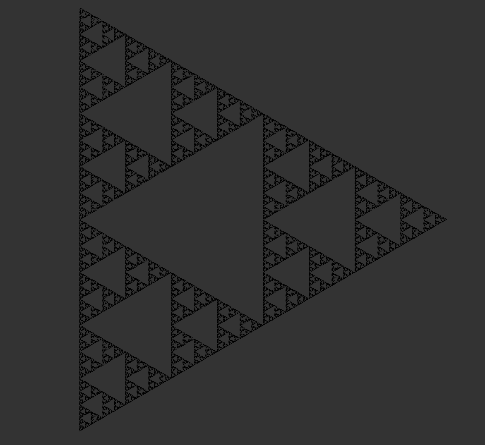

# [WIP] L-System generator/visualiser

A simple (well it was until i got feature creep) L-System generator / visualiser in c.

## Sierpiński arrowhead curve example:

```
A -> B-A-B
B -> A+B+A

Where A and B both equate to move forward.
And +/- equate to rotate 60° left/right.

Generated at depth 10.
```

## ToDo
- Allow for model rotation.
- Re-load model at different depth.
- Re-Do the Colours.
- Add usage instructions lol.
- Add a way to change the rule from within the simulation.
- Documentation.
- File format or smthn.
